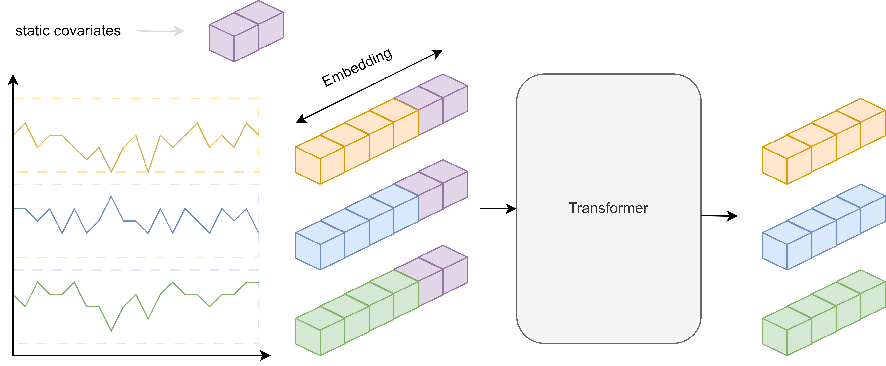

# Context-Aware Sequential Recommendation with Temporal and Context-Enhanced Attention using an Inverted Transformer Framework

**Changxin Li**  
Moscow Institute of Physics and Technology, Moscow, Russia  
vovalcx@gmail.com  
*September 20, 2024*

---

## Abstract
Traditional recommendation algorithms often fail to capture temporal dynamics and interaction sequences critical for modeling user behavior. This paper introduces a novel **iTransformer-based framework** that enhances sequential recommendation systems by:
- Treating variates as spatial dimensions in attention mechanisms
- Leveraging granular time-token attention
- Incorporating reversible instance normalization

## 1. Methodology

### 1.1 Architecture Overview


**Core Components**:
1. **Inverted Attention Block**  
   Processes features as spatial tokens using:
   ```python
   class InvertedAttention(nn.Module):
    def forward(self, x, x_mark=None, static_covariates=None, mask = None):
        x = self.embedding(x) + self.pos_emb(torch.arange(self.max_seq_length, device=x.device)).unsqueeze(0)
        x = self.dropout(x)
        #x = self.positional_encoding(x)
        _, _, N = x_mark.shape

        if x_mark is not None:
            y = self.ivert_embedding(x_mark.permute(0, 2, 1))
            #y = self.ivert_embedding(torch.cat([y, x_mark.permute(0, 2, 1)], 1))

        if static_covariates is not None:
            static_embed = self.static_embedding(static_covariates.to(torch.float))
            y = y + static_embed.unsqueeze(1)

        y = self.dropout(y)

        if mask is not None:
            x = x * mask
            
        for layer in self.layers:
            x, y= layer(x, y)
            if mask is not None:
                x = x * mask

        y = self.projector(y).permute(0, 2, 1)[:, :, : N - 2]

        return x, y